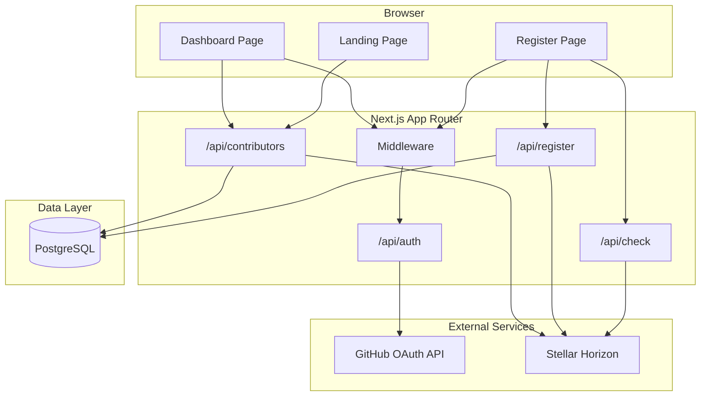
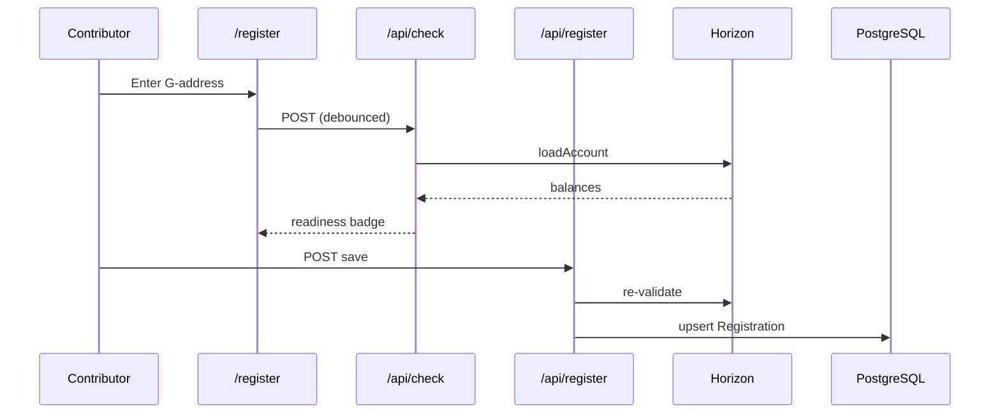

# Architecture

This document describes how **TrustBridge Dashboard** is designed. For setup instructions see [SETUP.md](./SETUP.md). For directory layout see [PROJECT_STRUCTURE.md](./PROJECT_STRUCTURE.md).

← Back to [README](../README.md)

---

## Overview

TrustBridge Dashboard is a **Next.js 14 App Router** application that solves contributor payout coordination on Stellar:

```
GitHub Identity  ──►  Registration DB  ──►  Horizon Validation  ──►  Wave CSV Export
     (OAuth)            (Prisma/PG)         (stellar-sdk)            (Maintainers)
```

### Core responsibilities

1. **Identity binding** — Map `github_username` → `stellar_address` after GitHub OAuth
2. **Readiness validation** — Query Horizon for funding, USDC trustline, XLM balance
3. **Maintainer operations** — Aggregate view, filters, batch re-check, CSV export

---

## System diagram



---

## Authentication & authorization

### GitHub OAuth (NextAuth.js)

- Provider: GitHub with scopes `read:user`, `user:email`, `read:org`
- Session strategy: **JWT** (no server-side session table required at runtime)
- On sign-in, user record is upserted in PostgreSQL with `githubId`, `githubUsername`, and `accessToken`
- The GitHub access token is **encrypted at rest** (AES-256-GCM, `TOKEN_ENCRYPTION_KEY`) before being written — see [`src/lib/token-crypto.ts`](../src/lib/token-crypto.ts) — and every encrypt/decrypt attempt is recorded in `TokenAuditLog` via [`src/lib/token-audit.ts`](../src/lib/token-audit.ts)
- The raw access token is **never** placed on the JWT or session object, so it is never sent to the browser; server code that needs it calls `getDecryptedGithubAccessToken(userId)` in `src/lib/auth.ts`

### Route protection (`src/middleware.ts`)

| Route | Requirement |
|-------|-------------|
| `/register` | Authenticated GitHub user |
| `/dashboard` | Authenticated + member of `GITHUB_MAINTAINER_ORG` |

Maintainer check flow:

1. After GitHub OAuth, JWT callback calls `GET https://api.github.com/user/orgs`
2. Compares org logins against `GITHUB_MAINTAINER_ORG`
3. Sets `session.user.isMaintainer` boolean

Non-maintainers hitting `/dashboard` are redirected to `/register?error=maintainer`.

---

## Data model

See `prisma/schema.prisma`.

```
User
├── githubId (unique)
├── githubUsername (unique)
├── accessToken (encrypted at rest — AES-256-GCM ciphertext, never plaintext)
├── registration → Registration (1:1)
└── auditLogs → TokenAuditLog (1:many)

Registration
├── stellarAddress (unique)
├── funded, trustlineReady, xlmBalance
└── lastCheckedAt

TokenAuditLog
├── userId
├── action (token_encrypted_at_signin | token_encryption_skipped | token_decrypted | token_decrypt_failed)
├── success
└── createdAt
```

NextAuth adapter models (`Account`, `Session`, `VerificationToken`) are included for future database-session support but JWT is used by default.

---

## Horizon validation pipeline

Implemented in `src/lib/horizon.ts` using **stellar-sdk** `Horizon.Server`.

### `/api/check` flow

1. Validate G-address format via `StrKey.isValidEd25519PublicKey`
2. `server.loadAccount(address)` — 404 means unfunded
3. Parse native XLM balance from `account.balances`
4. Check for matching asset trustline (`asset_code` + `asset_issuer`)
5. Compute readiness via `computeReadiness()` in `src/lib/stellar.ts`

### Readiness rules

| Condition | Status |
|-----------|--------|
| Not funded OR no trustline | `not_ready` |
| Funded + trustline, XLM < `NEXT_PUBLIC_MIN_XLM_BALANCE` | `low_reserve` |
| Funded + trustline + sufficient XLM | `ready` |

Default asset: **USDC** on Stellar mainnet (configurable via env).

---

## Registration flow



Registration enforces:

- Authenticated session
- Valid Stellar address format
- Unique `stellarAddress` across users (409 if taken)

---

## Maintainer dashboard flow

1. `GET /api/contributors` — list all registrations with computed readiness
2. **Re-check all** — `POST /api/contributors` batch-queries Horizon, updates DB
3. **Export CSV** — client-side download via `exportContributorsCsv()`

CSV columns: `github_username`, `stellar_address`, `readiness`, `funded`, `trustline`, `xlm_balance`, `last_checked_at`

---

## Frontend architecture

| Concern | Approach |
|---------|----------|
| Server components | Landing page (stats), layout metadata |
| Client components | Register, dashboard, interactive inputs |
| Server state | React Query (`Providers.tsx`) |
| Theming | `next-themes` + CSS variables (light/dark) |
| UI primitives | shadcn/ui-style components in `src/components/ui/` |

Key components:

- `AddressInput` — debounced live `/api/check` validation
- `TrustlineStatusBadge` — readiness indicator
- `ContributorTable` — sort, filter, CSV export
- `WaveReadinessBar` — aggregate progress bar

---

## Security considerations

- **Secrets server-side only** — `GITHUB_CLIENT_SECRET`, `DATABASE_URL`, `NEXTAUTH_SECRET`, `TOKEN_ENCRYPTION_KEY` never exposed to client
- **Tokens encrypted at rest** — `User.accessToken` is AES-256-GCM ciphertext; sign-in fails closed (stores nothing) if `TOKEN_ENCRYPTION_KEY` is missing or malformed rather than falling back to plaintext
- **No client-side access tokens** — the GitHub access token never appears on the NextAuth JWT or `session` object; it exists only encrypted in PostgreSQL, decrypted on demand server-side via `getDecryptedGithubAccessToken()`
- **Horizon calls server-side** — `/api/check` and `/api/actions/lookup` prevent CORS/rate-limit issues and keep validation logic centralized
- **Maintainer API guard** — `/api/contributors` and `/api/soroban/events` verify `isMaintainer` on every request
- **Address uniqueness** — prevents duplicate payout mappings

---

## Action lookup readiness API

`GET /api/actions/lookup?address=G...` (`src/app/api/actions/lookup/route.ts`) wraps the same Horizon check used by `/api/check`, but as a cacheable `GET` that also computes a `nextAction` hint (`fund_account`, `add_trustline`, `increase_reserve`, `none`) via [`src/lib/action-lookup.ts`](../src/lib/action-lookup.ts). Results are cached for 30s per `address:asset_code:asset_issuer` key in `verificationCache` (`src/lib/cache.ts`) to absorb bursts against Horizon rate limits. The registration wizard (`AddressInput`) uses the same pure `computeNextAction()` helper to show contributors what to do next.

---

## Soroban event timeline

The maintainer dashboard's **Soroban event timeline** panel (`src/components/SorobanEventTimeline.tsx`) shows recent contract events for `SOROBAN_CONTRACT_ID`, fetched server-side via `getSorobanEventTimeline()` (`src/lib/soroban.ts`) using `stellar-sdk`'s Soroban RPC client (`SOROBAN_RPC_URL`, default `soroban-testnet.stellar.org`). Exposed through `GET /api/soroban/events` (maintainer-only). RPC outages, rate limits, or a missing `SOROBAN_CONTRACT_ID` never throw — they surface as an `errors` array the panel renders inline, with an empty event list.

---

## Future: Soroban registry

When `SOROBAN_CONTRACT_ID` is set, registrations can be mirrored to a Soroban smart contract for trustless, on-chain contributor registry. The PostgreSQL layer remains the query-optimized source for dashboard aggregations; contract writes would happen in `/api/register` post-save.

---

## Related docs

- [Project structure](./PROJECT_STRUCTURE.md)
- [Environment variables](./ENVIRONMENT.md)
- [Deployment](./DEPLOYMENT.md)
- [Contributing](./CONTRIBUTING.md)
